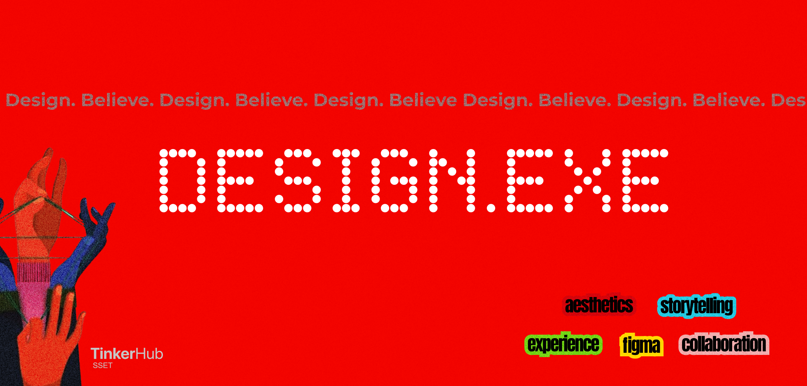

# **[SunCharge- solar powered power banks]**

**DESIGN.EXE designathon 2025**

> Our project introduces a sleek, solar-powered power bank designed for eco-conscious users who need portable, reliable energy on the go. It harnesses the power of the sun to charge your devices—anytime, anywhere—reducing dependence on non-renewable electricity.

We’re solving the problem of charging in remote areas and wasteful energy usage, especially for travelers, students, and outdoor enthusiasts. What makes it cool? It’s sustainable, stylish, and powered by nature—because the future of tech should be green.

## **Link to figma file**
https://www.figma.com/design/nNsbc7D6G4PJn4oCnpjO2c/Untitled?node-id=0-1&t=cH8ZNkhzYPUDT4GV-1

## **Hosted url**
Add the link here

## **Installation**
How on earth can we set up your project up and running?

## **Steps to run**  
Care to explain?

## **Acknowledgements**
Give credit to any resources, tutorials, libraries helped you build your project.

